# Lab – React Client for Blueprints (Redux + Axios + JWT)

> Basado en el cliente HTML/JS del repo de referencia, este laboratorio moderniza el _frontend_ con **React + Vite**, **Redux Toolkit**, **Axios** (con interceptores y JWT), **React Router** y pruebas con **Vitest + Testing Library**.

## Objetivos de aprendizaje

- Diseñar una SPA en React aplicando **componetización** y **Redux (reducers/slices)**.
- Consumir APIs REST de Blueprints con **Axios** y manejar **estados de carga/errores**.
- Integrar **autenticación JWT** con interceptores y rutas protegidas.
- Aplicar buenas prácticas: estructura de carpetas, `.env`, linters, testing, CI.

## Requisitos previos

- Tener corriendo el backend de Blueprints de los **Labs 3 y 4** (APIs + seguridad).
- Node.js 18+ y npm.

Ver la especificación de glosario clave, consulta las [Definiciones del laboratorio](./DEFINICIONES.md).

## Endpoints esperados (ajústalos si tu backend quedo diferente)

- `GET /api/blueprints` → lista general o catálogo para derivar autores.
- `GET /api/blueprints/{author}`
- `GET /api/blueprints/{author}/{name}`
- `POST /api/blueprints` (requiere JWT)
- `POST /api/auth/login` → `{ token }`

Configura la URL base en `.env`.

## Cómo arrancar

```bash
npm install
cp .env.example .env
# edita .env con la URL del backend
npm run dev
```

Abre `http://localhost:5173`

## Variables de entorno

Crea un archivo `.env` en la raíz:

```variable
VITE_API_BASE_URL=http://localhost:8080/api
```

> **Tip:** en producción usa variables seguras o un _reverse proxy_.

## Estructura

```carpetas
blueprints-react-lab/
├─ src/
│  ├─ components/
│  ├─ features/blueprints/blueprintsSlice.js
│  ├─ pages/
│  ├─ services/apiClient.js   # axios + interceptores JWT
│  ├─ store/index.js          # Redux Toolkit
│  ├─ App.jsx, main.jsx, styles.css
├─ tests/
├─ .github/workflows/ci.yml
├─ index.html, package.json, vite.config.js, README.md
```

## 📌 Requerimientos del laboratorio

## 1. Canvas (lienzo)

- Agregar un lienzo (Canvas) a la página.
- Incluir un componente `BlueprintCanvas` con un identificador propio.
- Definir dimensiones adecuadas (ej. `520×360`) para que no ocupe toda la pantalla pero permita dibujar los planos.

## 2. Listar los planos de un autor

- Permitir ingresar el nombre de un autor y consultar sus planos desde el backend (o mock).
- Mostrar los resultados en una tabla con las siguientes columnas:
  - Nombre del plano
  - Número de puntos
  - Botón `Open` para abrirlo

## 3. Seleccionar un plano y graficarlo

Al hacer clic en el botón `Open`, debe:

- Actualizar un campo de texto con el nombre del plano actual.
- Obtener los puntos del plano correspondiente.
- Dibujar consecutivamente los segmentos de recta en el canvas y marcar cada punto.

## 4. Servicios: `apimock` y `apiclient`

- Implementar dos servicios con la misma interfaz:
  - `apimock`: retorna datos de prueba desde memoria.
  - `apiclient`: consume el API REST real con Axios.
- La interfaz de ambos debe incluir los métodos:
  - `getAll`
  - `getByAuthor`
  - `getByAuthorAndName`
  - `create`
- Habilitar el cambio entre `apimock` y `apiclient` con una sola línea de código:
  - Definir un módulo `blueprintsService.js` que importe uno u otro según una variable en `.env`.
  - Ejemplo en `.env` (Vite):

```env
VITE_USE_MOCK=true
```

- `VITE_USE_MOCK=true` usa el mock.
- `VITE_USE_MOCK=false` usa el API real.

## 5. Interfaz con React

- El nombre del plano actual debe mostrarse en el DOM como parte del estado global (Redux).
- Evitar manipular directamente el DOM; usar componentes y props/estado.

## 6. Estilos

- Agregar estilos para mejorar la presentación.
- Se puede usar Bootstrap u otro framework CSS.
- Ajustar la tabla, botones y tarjetas para acercarse al mock de referencia.

## 7. Pruebas unitarias

- Agregar pruebas con Vitest + Testing Library para validar:
  - Render del canvas.
  - Envío de formularios.
  - Interacciones básicas con Redux (por ejemplo: dispatch de `fetchByAuthor`).

---

### Notas rápidas y recomendaciones

- Para el canvas en tests con jsdom: agregar un mock de `HTMLCanvasElement.prototype.getContext` en `tests/setup.js`.
- Para usar `@testing-library/jest-dom` con Vitest: en `tests/setup.js` importar `import '@testing-library/jest-dom'` y asegurarse de que Vitest provea el global `expect` (configurar `vitest.config.js` con la opción `test: { globals: true, setupFiles: './tests/setup.js' }`).
- Para la conmutación de servicios en Vite, usar `import.meta.env.VITE_USE_MOCK` para leer la variable en tiempo de ejecución.

## 📌 Recomendaciones y actividades sugeridas para el exito del laboratorio

1. **Redux avanzado**
   - [ ] Agrega estados `loading/error` por _thunk_ y muéstralos en la UI.
   - [ ] Implementa _memo selectors_ para derivar el top-5 de blueprints por cantidad de puntos.
2. **Rutas protegidas**
   - [ ] Crea un componente `<PrivateRoute>` y protege la creación/edición.
3. **CRUD completo**
   - [ ] Implementa `PUT /api/blueprints/{author}/{name}` y `DELETE ...` en el slice y en la UI.
   - [ ] Optimistic updates (revertir si falla).
4. **Dibujo interactivo**
   - [ ] Reemplaza el `svg` por un lienzo donde el usuario haga _click_ para agregar puntos.
   - [ ] Botón “Guardar” que envíe el blueprint.
5. **Errores y _Retry_**
   - [ ] Si `GET` falla, muestra un banner y un botón **Reintentar** que dispare el thunk.
6. **Testing**
   - [ ] Pruebas de `blueprintsSlice` (reducers puros).
   - [ ] Pruebas de componentes con Testing Library (render, interacción).
7. **CI/Lint/Format**
   - [ ] Activa **GitHub Actions** (workflow incluido) → lint + test + build.
8. **Docker (opcional)**
   - [ ] Crea `Dockerfile` (+ `compose`) para front + backend.

## Criterios de evaluación

- Funcionalidad y cobertura de casos (30%)
- Calidad de código y arquitectura (Redux, componentes, servicios) (25%)
- Manejo de estado, errores, UX (15%)
- Pruebas automatizadas (15%)
- Seguridad (JWT/Interceptores/Rutas protegidas) (10%)
- CI/Lint/Format (5%)

## Scripts

- `npm run dev` – servidor de desarrollo Vite
- `npm run build` – build de producción
- `npm run preview` – previsualizar build
- `npm run lint` – ESLint
- `npm run format` – Prettier
- `npm test` – Vitest

---

### Extensiones propuestas del reto

- **Redux Toolkit Query** para _caching_ de requests.
- **MSW** para _mocks_ sin backend.
- **Dark mode** y diseño responsive.

> Este proyecto es un punto de partida para que tus estudiantes evolucionen el cliente clásico de Blueprints a una SPA moderna con prácticas de la industria.


---
# REPORTE DE LABORATORIO
### Integrantes: 
      - Laura Alejandra Venegas Piraban 
      - Sergio Alejandro Idarraga Torres
---
## 1. Canvas (lienzo)  

Se implementó un componente de canvas con tamaño definido para dibujar los planos sin ocupar toda la pantalla. En la imagen se observa el área de dibujo integrada en la interfaz, lista para renderizar puntos y segmentos cuando se selecciona un plano.

<div align="center">
  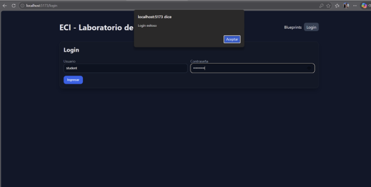
</div>  

## 2. Listar los planos de un autor  

Se habilitó la consulta por autor y la visualización de resultados en tabla, mostrando nombre del plano, cantidad de puntos y la acción Open. La imagen evidencia el listado obtenido y la estructura esperada para navegar entre los planos disponibles.

<div align="center">
  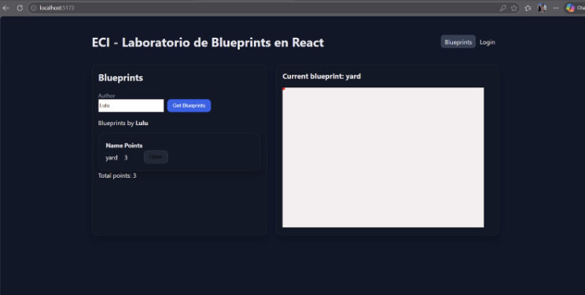
</div>  

## 3. Seleccionar un plano y graficarlo  

Al presionar Open se actualiza el plano actual y se recuperan sus puntos para dibujar las líneas de forma consecutiva en el canvas. En la imagen se aprecia el plano cargado y graficado correctamente, confirmando la interacción entre lista, estado y lienzo.

<div align="center">
  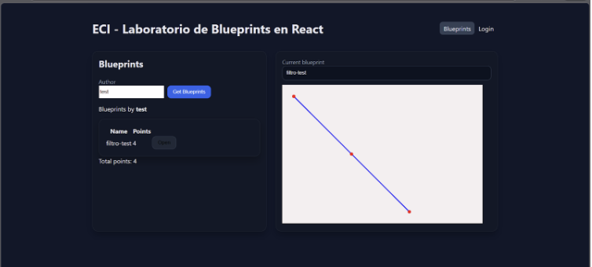
</div> 


## 4. Servicios: `apimock` y `apiclient`

En este punto se implementaron dos servicios con la misma interfaz para desacoplar la fuente de datos de la interfaz. La conmutacion se realiza con una sola variable de entorno: cuando VITE_USE_MOCK=false se usa apiclient (API real con Axios) y cuando VITE_USE_MOCK=true se usa apimock (datos de prueba en memoria).  

**Mock** referencia del contenido mock y resultado esperado de la carga en memoria.

<div align="center">
  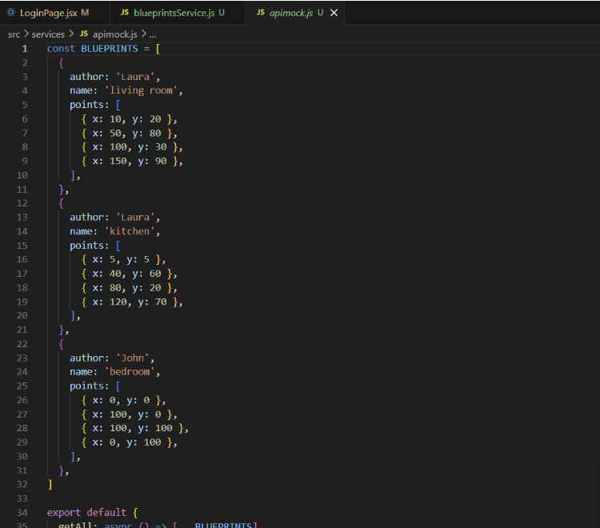
</div>

**VITE_USE_MOCK=false:** configuracion de entorno en false, activando el consumo de la API real.

<div align="center">
  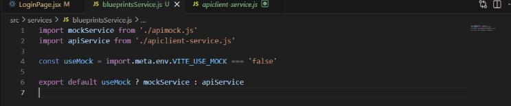
</div>

Evidencia en ejecucion del flujo con API real, consultando datos del backend.

<div align="center">
  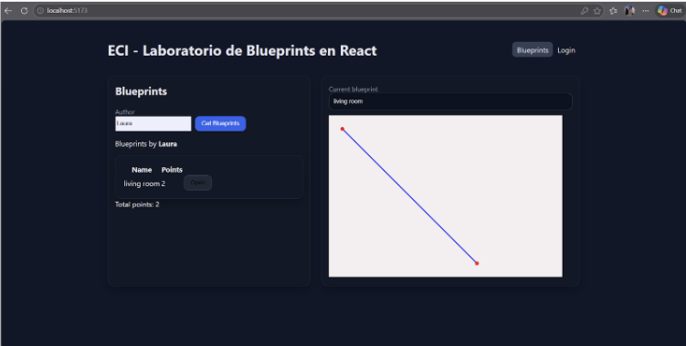
</div>

**VITE_USE_MOCK=true:** configuracion de entorno en true, habilitando el servicio mock.

<div align="center">
  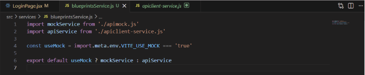
</div>

Evidencia en ejecucion usando datos simulados desde apimock.

<div align="center">
  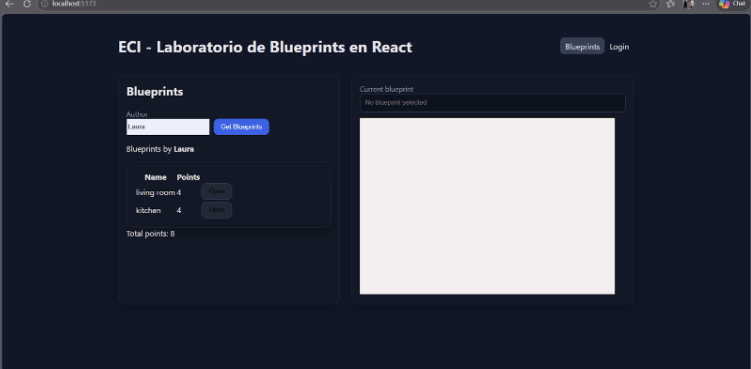
</div>

## 5. Interfaz con React  

En esta parte se evidencia que el nombre del plano seleccionado se muestra en la interfaz como estado global de Redux, sin manipulacion directa del DOM. La actualizacion de la vista se realiza mediante componentes React y flujo de props/estado, manteniendo una arquitectura declarativa.

En la siguiente imágen se muestra la interfaz principal con el estado del plano reflejado en pantalla y los componentes renderizados de forma reactiva.

<div align="center">
  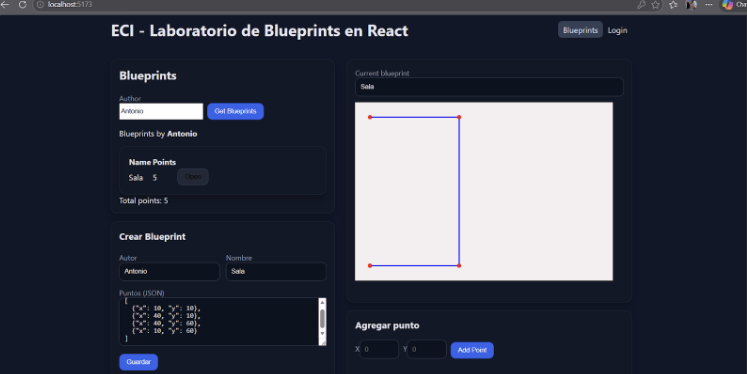
</div>

En la siguiente imágen se evidencia la estructura y el comportamiento de actualizacion de la UI al cambiar el estado desde Redux.

<div align="center">
  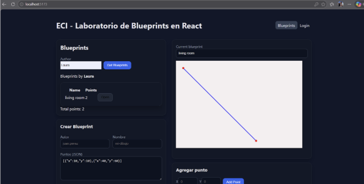
</div>   

## 6. Estilos

En este punto se implemento una capa de estilos CSS personalizada, sin depender de frameworks externos, con el objetivo de mejorar la legibilidad, la jerarquia visual y la experiencia de uso de la aplicacion. La base del diseño se construyo sobre variables CSS definidas en :root, lo que permitio centralizar colores, superficies y efectos de sombra para mantener consistencia en toda la interfaz. Se adopto una estetica dark mode con acentos azul/violeta, combinando un fondo oscuro con gradientes sutiles para dar profundidad y separar visualmente las zonas de trabajo.

La mejora se aplico en los componentes principales: tarjetas con sombras y realce en estado activo, botones con gradiente y transiciones para click, campos de entrada con foco destacado y diferencia visual para valores de solo lectura, tabla con encabezados mas claros y filas resaltadas al pasar el cursor, y canvas con borde y glow para integrarlo al lenguaje visual general. Tambien se ajusto la navegacion con un estado activo mas evidente y se personalizo la scrollbar para mantener coherencia estetica. 

<div align="center">
  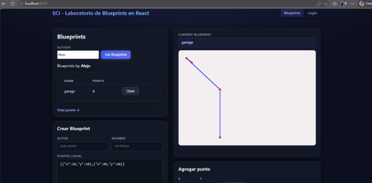
</div>  


## 7. Pruebas unitarias

En este punto se presentan evidencias de la ejecucion de pruebas unitarias orientadas a validar tres aspectos clave del laboratorio: el render del canvas, el envio de formularios y las interacciones basicas con Redux. Estas pruebas permiten comprobar que los componentes principales responden correctamente ante acciones del usuario y que el flujo esperado de la aplicacion se mantiene de forma consistente.

La primera imagen muestra la ejecucion general de la suite de pruebas, evidenciando que los escenarios definidos para la interfaz fueron corridos satisfactoriamente. La segunda imagen complementa esta evidencia con el detalle del resultado obtenido, respaldando la validacion de comportamientos como la carga del lienzo, el procesamiento de datos ingresados en formularios y la respuesta del estado global ante acciones relacionadas con la consulta de blueprints.

<div align="center">
  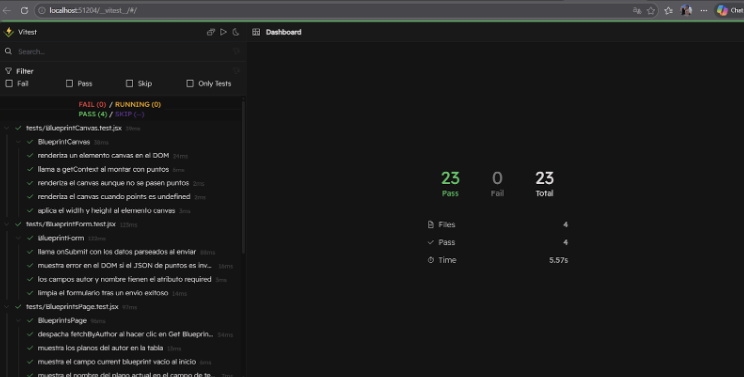
</div>
<div align="center">
  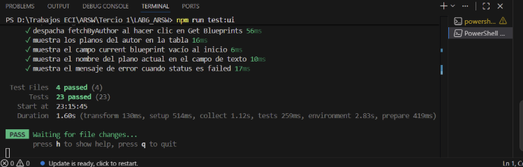
</div>
